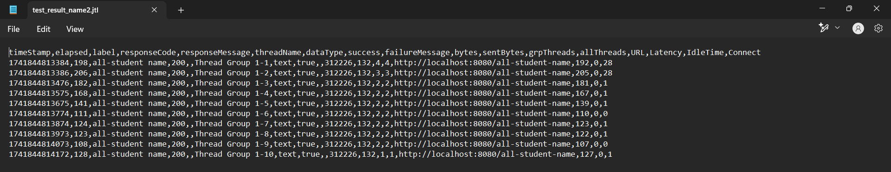
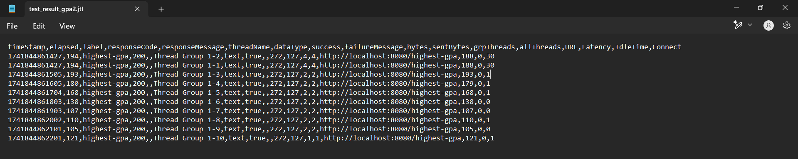

# Module 5: Java Profiling

## Before Optimization
### Test Results from JMeter GUI
### /all-student-name
**View Results Tree**

**View Results In Table**

**Summary Report**

**Graph Results**

### /highest-gpa
**View Results Tree**

**View Results In Table**

**Summary Report**

**Graph Results**

### Test Results from Command Line
### /all-student-name

### /highest-gpa

## After Optimization
### Test Results from Command Line
### /all-student-name

### /highest-gpa

## Conclusion
Setelah dilakukan optimisasi, _latency_ yang ditunjukkan oleh JMeter menunjukkan penurunan yang sangat besar. Ini menunjukkan bahwa server memberikan _response_ yang jauh lebih cepat dibandingkan sebelumnya, sehingga _request_ diproses dengan lebih efisien dan cepat. Peningkatan ini menunjukkan bahwa optimisasi yang dilakukan sebelumnya itu efektif dan penting untuk dilakukan, yang menyebabkan aplikasi menjadi lebih efisien dan performa juga meningkat.

## Reflection

### 1. What is the difference between the approach of performance testing with JMeter and profiling with IntelliJ Profiler in the context of optimizing application performance?

Pengujian performa dengan JMeter fokus pada simulasi beban pengguna dan mengukur waktu _response_ dari aplikasi, throughput, serta tingkat error di berbagai kondisi. Pengujian dengan JMeter membantu mengidentifikasi masalah performa dari perspektif pengguna akhir. Di sisi lain, _profiling_ dengan IntelliJ Profiler melibatkan analisis perilaku internal aplikasi, seperti penggunaan CPU, alokasi memori, dan waktu eksekusi metode dan digunakan untuk menemukan bagian kode yang kurang efisien.

### 2. How does the profiling process help you in identifying and understanding the weak points in your application?

Proses _profiling_ membantu dengan memberikan data lengkap mengenai performa masing-masing metode atau komponen di dalam aplikasi. Dengan menganalisis penggunaan CPU, konsumsi memori, dan waktu eksekusi metode, saya menjadi dapat mengidentifikasi bagian kode yang menghabiskan waktu atau memory secara berlebihan, sehingga memudahkan dalam menentukan area mana yang perlu dioptimalkan dan dibuat lebih efisien.

### 3. Do you think IntelliJ Profiler is effective in assisting you to analyze and identify bottlenecks in your application code?

Bagi saya sendiri, IntelliJ Profiler cukup efektif dalam menganalisis dan mengidentifikasi _bottleneck_ yang ada. IntelliJ Profiler menyediakan berbagai fitur yang komprehensif untuk memvisualkan dan mengukur berbagai standar performa, sehingga memudahkan saya dalam menemukan dan mengatasi masalah performa pada kode yang sudah dibuat.

### 4. What are the main challenges you face when conducting performance testing and profiling, and how do you overcome these challenges?

Tantangan utama yang saya hadapi ketika melakukan _performance testing_ dan _profiling_ adalah memahami data yang dihasilkan karena data tersebut terkadang bersifat kompleks dan memiliki banyak metrik, seperti waktu _response_, _throughput_, penggunaan CPU, dan memori. Saya merasa kesulitan dalam menginterpretasikan detail-detail teknis yang muncul dan menentukan hubungan antar metrik yang berbeda. Hasil yang diperoleh dari _performance testing_ dan _profiling_ juga terkadang tidak konsisten, sehingga saya harus melakukan validasi ulang untuk memastikan keakuratannya. Untuk mengatasi tantangan ini, saya mencoba untuk mencari tahu mengena metrik-metrik performa yang ada agar dapat mengidentifikasi masalah secara lebih tepat.

### 5. What are the main benefits you gain from using IntelliJ Profiler for profiling your application code?

Manfaat utama yang saya dapatkan adalah kemampuan untuk mengidentifikasi dan memperbaiki _bottleneck_ performa yang masih ada dalam aplikasi saya, sehingga saya bisa melakukan optimisasi pada kode dan meningkatkan efisiensi aplikasi secara keseluruhan. Saya dapat melihat secara mendetail penggunaan CPU, alokasi memori, dan waktu eksekusi setiap metode dalam kode saya menggunakan IntelliJ Profiler. Hal ini memungkinkan saya untuk menemukan masalah yang sebelumnya saya jarang pertimbangkan, yaitu masalah efisiensi kode. Selain itu, integrasi IntelliJ Profiler dengan IDE IntelliJ juga membuat proses profiling menjadi lebih lancar dan intuitif.

### 6. How do you handle situations where the results from profiling with IntelliJ Profiler are not entirely consistent with findings from performance testing using JMeter?

Jika terjadi ketidakkonsistenan antara hasil yang saya peroleh dari IntelliJ Profiler dan JMeter, saya akan melakukan _cross-check_ konfigurasi _testing_ dan mencoba memahami apa yang menyebabkan perbedaan terjadi. Saya juga akan mengulang _testing_ berkali-kali dan melakukan test tambahan untuk mendapatkan hasil yang lebih konsisten. Saya juga coba untuk melihat apakah ada yang berbeda pada data yang diuji antara kedua metode. Dengan ini, saya bisa mendapatkan hasil yang lebih konsisten antara IntelliJ Profiler dan JMeter.

### 7. What strategies do you implement in optimizing application code after analyzing results from performance testing and profiling? How do you ensure the changes you make do not affect the application's functionality?

Saya akan memprioritaskan optimasi dengan mempertimbangkan seberapa besar dampaknya terhadap performa serta kemudahan implementasinya. Setelah menganalisis hasil testing dan profiling, saya akan melakukan _refactoring_ pada kode yang masih kurang efisien dan mengoptimalkan algoritma untuk mencapai performa yang lebih optimal. Untuk memastikan setiap perubahan tidak mengganggu fungsionalitas aplikasi, saya selalu menguji dengan unit testing, integration testing, dan menerapkan continuous integration. Hal ini memastikan aplikasi tetap bekerja dengan baik, sambil terus mengalami peningkatan performa.