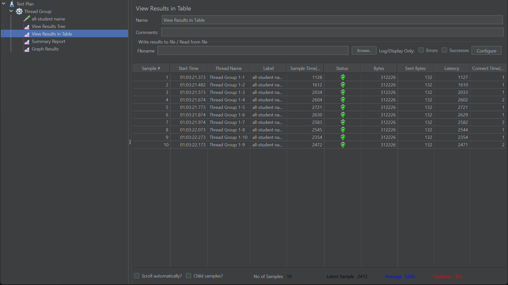
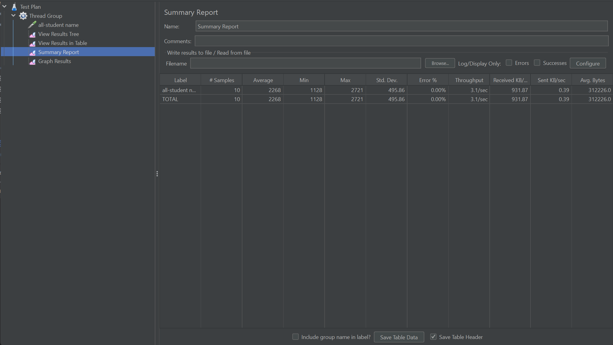
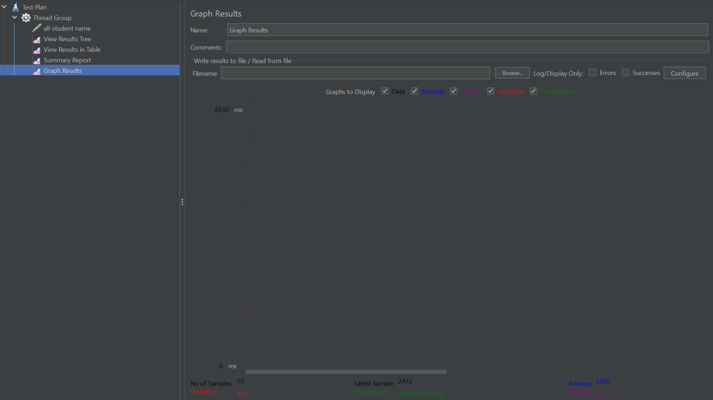
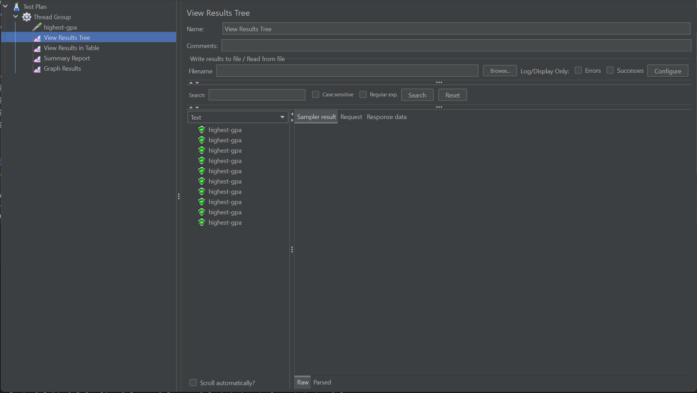
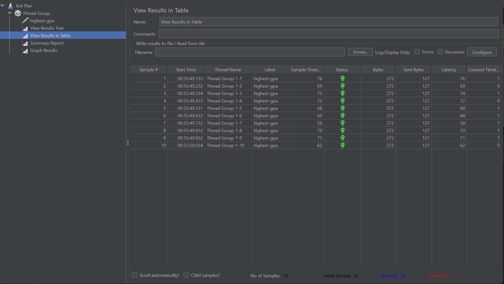
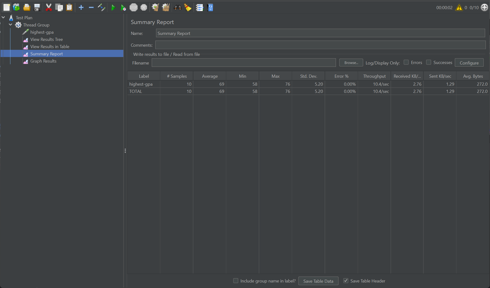
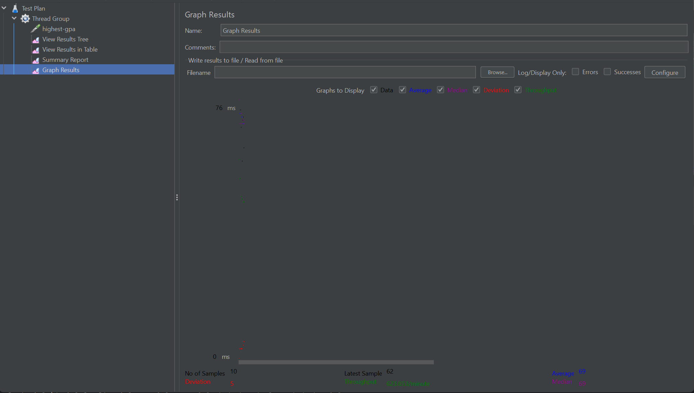
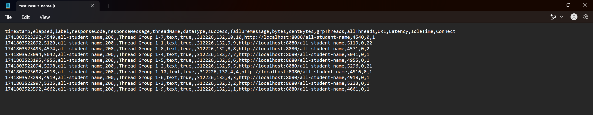
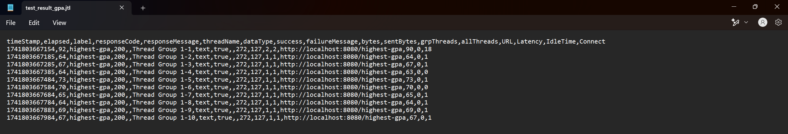

# Module 5: Java Profiling

## Test Results from Jmeter GUI
### /all-student-name
**View Results Tree**

**View Results In Table**

**Summary Report**

**Graph Results**

### /highest-gpa
**View Results Tree**

**View Results In Table**

**Summary Report**

**Graph Results**

## Test Results from Command Line
### /all-student-name

### /highest-gpa
